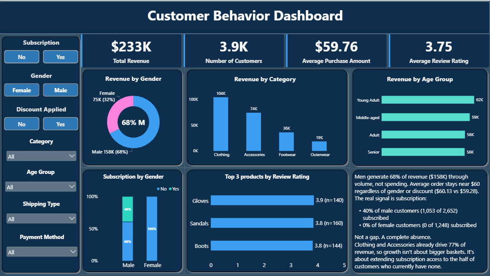

# Customer Behavior Data Analyst Portfolio Project

End-to-end analysis of a retail customer transactions dataset containing **3,900 records**, using **SQL** for exploratory analysis and **Power BI** for an interactive, insight-driven dashboard.

The project goes beyond descriptive charting to identify a specific, actionable finding:

> **Subscription enrollment is completely absent among female customers despite near-identical spending and review behavior across genders.**

---

## Project Overview

* **Dataset:** Retail customer shopping transactions — 3,900 rows, 18 columns covering demographics, purchase details, subscription status, discounts, reviews, and shipping
* **Tools Used:** MySQL, Power BI, Python (Pandas)
* **Deliverables:**

  * 10 SQL analysis queries
  * Interactive Power BI dashboard
  * Data validation using Python
  * Analytical findings and business recommendations

---

## Key Finding

### Subscription Gap by Gender

**0% of female customers (0 of 1,248) are subscribed, compared to 40% of male customers (1,053 of 2,652).**

This is not simply a difference in engagement  it is a **complete absence of female subscribers in the dataset**.

At the same time, spending and review behavior is almost identical:

| Metric                | Female |      Male |
| --------------------- | -----: | --------: |
| Average Order Value   | $59.54 |    $60.25 |
| Average Review Rating |   3.75 |      3.74 |
| Subscribers           |  **0** | **1,053** |
| Subscription Rate     | **0%** |   **40%** |

Because purchasing behavior and ratings are nearly identical, the data does not support the explanation that female customers simply "engage less."

The divergence appears specifically in **subscription status**.

Possible explanations that should be investigated include:

* Subscription program rollout differences
* Eligibility restrictions
* Data collection or labeling issues
* Demographic-specific subscription rules
* Other business constraints

A real-world analyst should **flag this finding for investigation before using subscription KPIs at face value.**

---

## Supporting Findings

### 1. Revenue by Gender

* **Male customers:** 68% of revenue — approximately **$158K**
* **Female customers:** 32% of revenue — approximately **$75K**

The revenue difference appears primarily related to the different number of customers in the dataset, since average order values are almost identical.

---

### 2. Revenue by Category

**Clothing and Accessories account for approximately 77% of total revenue.**

These categories represent the largest revenue contribution in the dataset.

---

### 3. Discount Impact

Average order value remains relatively flat across discount status:

| Discount Status  | Average Purchase |
| ---------------- | ---------------: |
| No Discount      |           $60.13 |
| Discount Applied |           $59.28 |

This suggests that discount promotions are **not meaningfully increasing basket size** in this dataset.

---

### 4. Loyalty vs Subscription

Customers with **5+ previous purchases** have a subscription rate of approximately **27.6%**, compared with **27.0%** for the overall baseline.

> **Repeat purchasing and subscription enrollment appear relatively independent rather than forming a clear conversion funnel.**

---

## SQL Analysis

The `queries/` folder contains **10 SQL queries** covering key customer and sales questions.

| #  | Analysis Question                                                   |
| -- | ------------------------------------------------------------------- |
| 1  | Total revenue by gender                                             |
| 2  | Discount users who still spent above the average purchase amount    |
| 3  | Top 5 products by average review rating                             |
| 4  | Average purchase amount: Standard vs Express shipping               |
| 5  | Subscriber vs non-subscriber spending comparison                    |
| 6  | Top 5 products by discount-usage rate                               |
| 7  | Customer segmentation (New / Returning / Loyal) by purchase history |
| 8  | Top 3 most-purchased products per category                          |
| 9  | Subscription rate among repeat buyers (5+ previous purchases)       |
| 10 | Revenue contribution by age group                                   |

### SQL Techniques Used

* Aggregation
* `GROUP BY`
* `WHERE`
* `HAVING`
* Subqueries
* `CASE` statements
* CTEs
* Window functions
* `ROW_NUMBER()`
* `PARTITION BY`
* Average calculations
* Revenue calculations

**Query 7** uses a CTE with a `CASE` statement to segment customers into:

* New
* Returning
* Loyal

**Query 8** uses:

```sql
ROW_NUMBER() OVER (
    PARTITION BY Category
    ORDER BY Purchase_Count DESC
)
```

to rank products within each category and identify the top 3 products.

---

## Power BI Dashboard

The project includes an interactive **Power BI dashboard** focused on customer behavior, revenue, and subscription analysis.

### Dashboard Filters

The dashboard supports filtering by:

* Subscription Status
* Gender
* Discount Applied
* Age Group
* Category
* Shipping Type
* Payment Method

All visuals update dynamically based on the selected customer segment.

### Dashboard Includes

* **KPI Summary**

  * Total Revenue
  * Customer Count
  * Average Purchase Amount
  * Average Review Rating
* Revenue by Gender
* Revenue by Category
* Revenue by Age Group
* Subscription Rate by Gender
* Customer Segments by Purchase History
* Top 3 Products by Review Rating
* Sample size for product ratings
* Narrative insight panel highlighting the key subscription finding

### Dashboard Preview

Static preview:



Interactive dashboard:

```text
dashboard/customer_behaviour.pbix
```

Open the `.pbix` file using **Power BI Desktop**.

---

## Repository Structure

```text
customer-behavior-analysis/
│
├── data/
│   └── customer_shopping_behavior.csv
│
├── queries/
│   └── customer_behavior_sql_queries.sql
│
├── dashboard/
│   ├── customer_behaviour.pbix
│   └── dashboard_screenshot.png
│
└── README.md
```

---

## How to Use

### 1. Clone the Repository

```bash
git clone https://github.com/SheikhAnandee/customer-behavior-analysis.git
```

### 2. Import the Dataset

Import:

```text
data/customer_shopping_behavior.csv
```

into a MySQL database.

### 3. Run the SQL Analysis

Open:

```text
queries/customer_behavior_sql_queries.sql
```

in a MySQL-compatible client and run the queries against the imported dataset.

### 4. Open the Power BI Dashboard

Open:

```text
dashboard/customer_behaviour.pbix
```

using **Power BI Desktop**.

You can then interact with the filters and explore the customer behavior analysis.

---

## Skills Demonstrated

### SQL

* Data aggregation
* Subqueries
* CTEs
* Window functions
* Customer segmentation
* Business-oriented SQL analysis

### Power BI

* Dashboard design
* DAX measures
* KPI cards
* Cross-filtering
* Interactive visualizations
* Data storytelling

### Python

* Pandas
* Data validation
* Dataset exploration
* Cross-checking analytical results

### Data Analytics

* Exploratory data analysis
* Customer segmentation
* Revenue analysis
* Subscription analysis
* Identifying unusual patterns
* Data-quality investigation
* Translating data into business questions

---

##  Business Perspective

The objective of this project was not simply to create charts.

The analysis demonstrates an important data-analyst mindset:

> **Don't just report what the dashboard says — question whether the result makes business sense.**

The complete absence of female subscribers, despite nearly identical purchasing and review behavior, is a pattern that should be investigated before making decisions based on subscription KPIs.

### Suggested Investigation Steps

1. Verify whether female customers were eligible for the subscription program.
2. Check whether subscription data was collected consistently across customer groups.
3. Investigate whether the subscription rollout differed by demographic segment.
4. Review the subscription signup funnel for potential barriers.
5. Validate the finding against a larger or more recent dataset.

---

## 👨‍💻 Author

**Sheikh Anandee Hasan**

* **GitHub:** [SheikhAnandee](https://github.com/SheikhAnandee)
* **Focus:** Data Analytics · Data Science · AI

---

⭐ If you find this project useful, feel free to explore the repository and dashboard.
\
